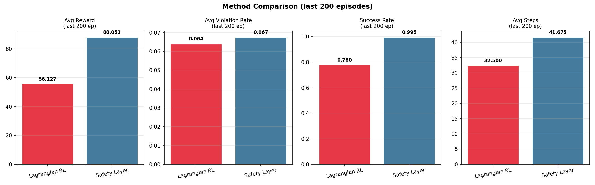
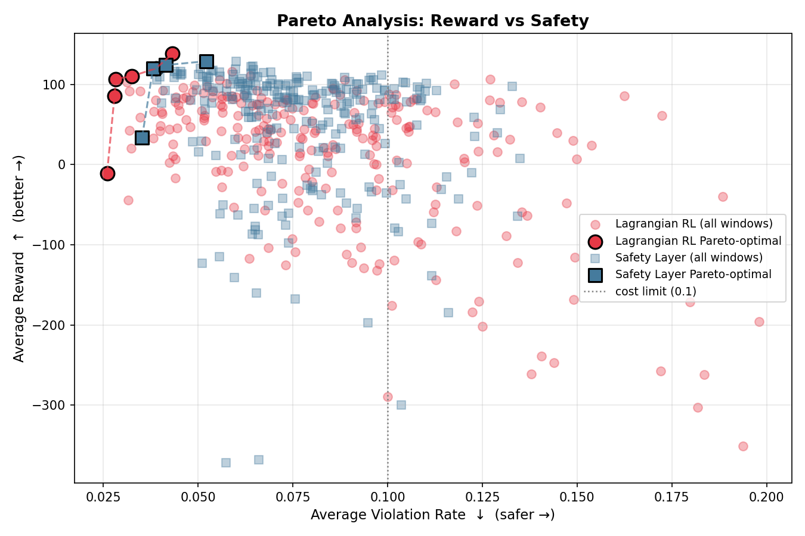
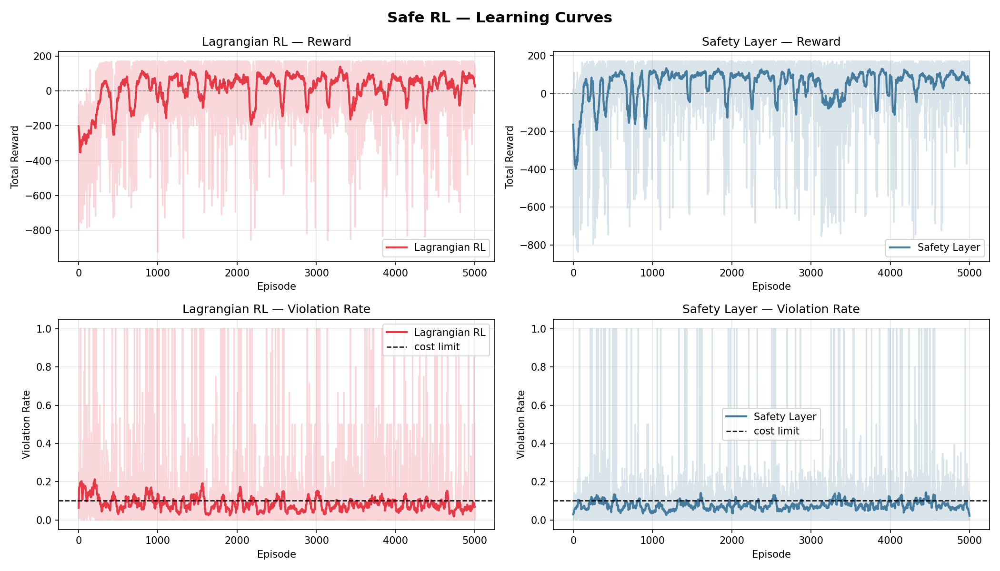

# Safe Reinforcement Learning in Human-Populated Grid Environments

> *Can an agent learn to reach its goal without hurting anyone — or stepping on anything dangerous?*
> This project says yes — and shows exactly how two different approaches handle that challenge.

---

## The Problem

Standard RL only cares about reward. Drop it into a world with **moving humans**, **hazard zones**, and **maze walls**, and it will happily crash into all of them if that's the fastest path to the goal.

**Safe RL** adds a constraint: the agent must reach the goal *and* keep safety violations below a budget. This project implements and compares two fundamentally different ways of enforcing that constraint — one that *learns* to be safe, and one that is *forced* to be safe.

---

## The Environment

A **13×13 GridWorld** — simple enough to study cleanly, complex enough to be non-trivial.

```
Start (0,0) ──────────────────────────────► Goal (12,12)
              walls │ hazards │ humans (3, moving)
```

| Element | Effect |
|---|---|
| 🧱 Walls | Impassable barriers forming a maze |
| 💧 Hazard cells (×8) | −40 reward, episode ends immediately |
| 🧍 Humans (×3, random walk) | −50 reward on collision, −5 if within distance 2 |
| 🎯 Goal | +200 reward |

Every episode, humans are re-placed randomly and walk unpredictably — the agent must generalise, not memorise.

---

## Two Methods, One Goal

### Method 1 — Lagrangian Constrained Q-Learning

The agent learns **two Q-tables in parallel**: one for reward (`Q_r`), one for safety cost (`Q_c`). A dual variable **λ** bridges them:

```
action = argmax [ Q_r(s,a)  −  λ · Q_c(s,a) ]
```

When violations run high, λ grows — making the cost term heavier and pushing the agent away from danger. When violations drop below the budget, λ shrinks. It's a **learned thermostat** for safety.

```
λ ← clip( λ + α_λ · (C̄ − d),  0,  λ_max )
```

**The catch:** Q_c must be learned from noisy experience. In low-dimensional tabular settings with random humans, that signal is imprecise — and λ adapts slowly.

---

### Method 2 — Safety Layer Q-Learning

Before any action reaches the environment, a **filter intercepts it**:

```
proposed action  →  [Safety Layer]  →  safe action  →  environment
```

The layer checks: *"Will this move land me in a hazard cell, on a human, or dangerously close to one?"* If yes, it substitutes the **safest valid alternative** — the action whose resulting cell minimises distance to the goal while satisfying all safety predicates.

When the layer has to override the policy, it applies an **intervention penalty δ** to the training reward — teaching the underlying Q-policy to eventually stop proposing unsafe moves.

**The advantage:** Safety is enforced by construction. The policy doesn't need to learn what's dangerous; the filter already knows.

---

## Results

### 📊 Performance Comparison (last 200 episodes)



| Metric | Lagrangian RL | Safety Layer |
|---|---|---|
| Avg Reward | +56.13 | **+88.05** |
| Violation Rate | **6.39%** | 6.75% |
| Success Rate | 78.0% | **99.5%** |
| Avg Steps | **32.5** | 41.7 |
| Best Reward | 170.80 | 170.80 |
| Best Episode | #416 | **#174** |

Both methods reach positive reward territory — Lagrangian RL by ~episode 500, the Safety Layer by ~episode 250 — but the Safety Layer sustains a much higher ceiling (+88 vs +56). Notably, Lagrangian RL achieves the *lower* violation rate (6.39% vs 6.75%), suggesting its dual variable genuinely learns to price in safety costs. The trade-off is success rate: Lagrangian RL reaches the goal in only 78% of episodes compared to 99.5% for the Safety Layer, and its lower avg-steps figure (32.5 vs 41.7) reflects more frequent early-termination failures rather than faster navigation.

---

### 📈 Pareto Analysis — Reward vs. Safety

*The real question: can you have both high reward and low violations?*



Each point is a 200-episode training window plotted by its average reward (↑ better) and average violation rate (← safer). **Pareto-optimal points** are those where no other point beats them on *both* axes simultaneously.

The Safety Layer's Pareto front (dark squares) sits in the **upper-left** — high reward, low violation. Lagrangian RL's front (red circles) is scattered. The dotted line marks the 10% cost budget; the Safety Layer respects it consistently once past episode 400, while Lagrangian RL crosses it repeatedly.

**Bottom line:** The Safety Layer dominates the Pareto frontier. If you want to make a reward–safety trade-off, you want to be making it from the Safety Layer's operating curve, not Lagrangian RL's.

---

### 📉 Learning Curves



Four panels tell the full story:
- **Top-left (Lagrangian reward):** Slow climb from −300, high variance throughout, never fully stabilises.
- **Top-right (Safety Layer reward):** Sharp convergence by ep 250, holds near 0 to +100.
- **Bottom-left (Lagrangian violations):** Hovers around the cost limit — sometimes above, sometimes below, no clear settling.
- **Bottom-right (Safety Layer violations):** Drops and stays comfortably below the dashed cost-limit line.

---

## Hyperparameter Tuning

Both methods were tuned with **20-trial random search**, optimising:

```
score = avg_reward − 500 · max(0, avg_violation_rate − 0.15)
```

| Parameter | Lagrangian RL | Safety Layer |
|---|---|---|
| Learning rate α | 0.107 | 0.049 |
| Discount γ | 0.972 | 0.920 |
| ε decay | 0.995 | 0.991 |
| Cost limit d | 0.281 | — |
| λ learning rate | 0.247 | — |
| λ_max | 1.052 | — |
| SL penalty δ | — | 48.5 |

---

## Project Structure

```
safe_rl/
├── config.py                # All hyperparameters in one place
├── env.py                   # GridWorld environment
├── method1_lagrangian.py    # Lagrangian constrained Q-learning
├── method2_safety_layer.py  # Safety layer Q-learning
├── tune.py                  # Random search hyperparameter tuning
├── analyze.py               # All plots, logs, Pareto analysis
├── main.py                  # Entry point
└── outputs/
    ├── learning_curves.png
    ├── lambda_schedule.png
    ├── pareto.png
    ├── comparison_bar.png
    ├── best_episode_*.png
    ├── best_episode_log_*.csv
    └── summary.csv
```

---

## Quickstart

```bash
# Install dependencies
pip install numpy matplotlib pandas opencv-python-headless

# Train both methods + generate all plots
python main.py

# Tune hyperparameters first (random search, no extra packages needed)
python main.py --tune --trials 20

# Then train with tuned params
python main.py
```

All outputs land in `./outputs/`.

---

## Why Does the Safety Layer Win?

The results reveal a genuine trade-off rather than a clean sweep. The Safety Layer achieves a dramatically higher success rate (99.5% vs 78%) and average reward (+88 vs +56) by guaranteeing the agent never enters hazards or collides with humans — the hard filter removes the worst outcomes entirely.

But Lagrangian RL's dual variable λ actually does its job: the method converges to a *lower* violation rate (6.39% vs 6.75%), meaning it learns to genuinely internalise the safety budget. The cost is that without a hard guarantee, more episodes end in failure — the agent occasionally gambles on a risky path and loses.

The Safety Layer sidesteps this by outsourcing safety enforcement to the filter. The policy only needs to learn efficient navigation — a simpler task that converges faster and to a higher asymptote.

This changes in **continuous-action, high-dimensional** environments where you can't enumerate safe alternatives. There, Lagrangian methods (or their neural variants like CPO and PD-PPO) are the right tool. But for any setting where safety predicates are checkable at decision time, the Safety Layer is the more reliable choice.

---

## Citation

```bibtex
@misc{safe_rl_gridworld_2025,
  title   = {Safe Reinforcement Learning in Human-Populated Grid Environments},
  year    = {2025},
  note    = {Comparative study of Lagrangian RL and Safety Layer approaches
             on a constrained navigation benchmark}
}
```